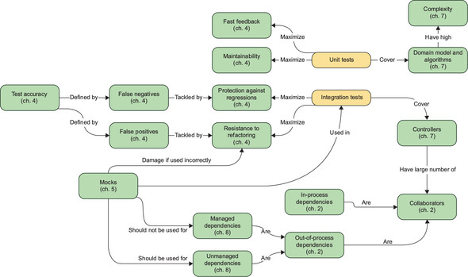
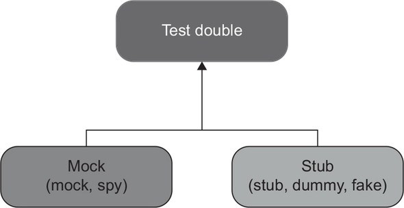
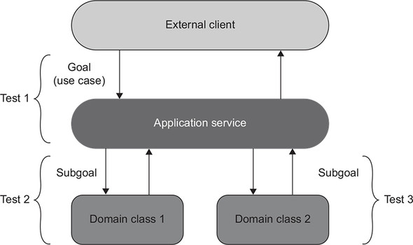
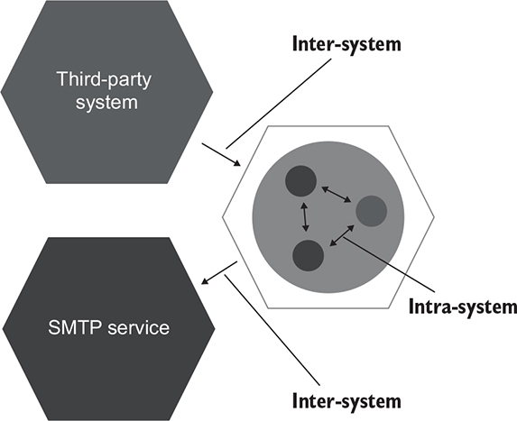
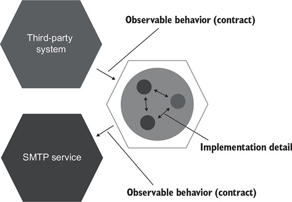
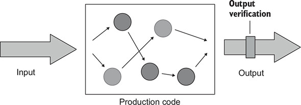
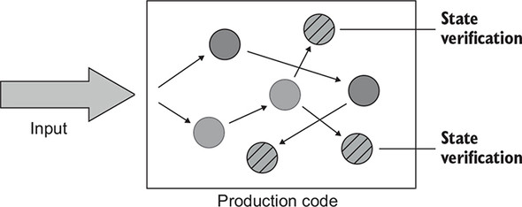
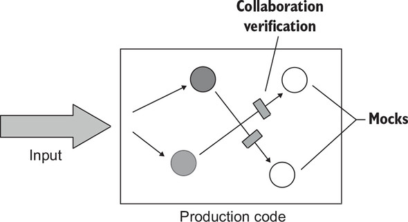
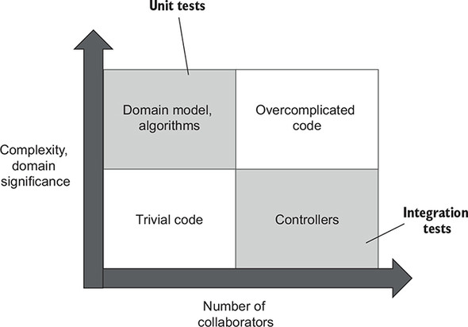

# Unit Testing Principles, Practices, and Patterns
`Vladimir Khorikov`

## チャプターマップ


### 4章
#### 単体テストの4つの柱
- Protection against regressions (リグレッション[バグ発生]を防ぐ)[^1]
- Resistance to refactoring (リファクタリングに耐える)
- Fast feedback (迅速なフィードバック)
- Maintainability (保守性)

[^1]:ソフトウェア開発の過程で不具合が発見されプログラムが修正されることはよくあるが、その修正によってそれまで正常に動作していた部分が異状をきたすようになることがある。このような現象を「デグレード」「リグレッション」などという

### テストダブルには5つのバリエーションがあります

- モックは、今後のインタラクションをエミュレートして調べるのに役立ちます。これらの相互作用は、SUTが依存関係に対して行って状態を変更するための呼び出しです。
- スタブは、着信インタラクションをエミュレートするのに役立ちます。これらの相互作用は、入力データを取得するためにSUTが依存関係に対して行う呼び出しです


### DDD
- さまざまなレイヤーで動作するテストにはフラクタル性があります。さまざまなレベルで同じ動作を検証します。アプリケーションサービスのテストでは、ビジネスユースケース全体がどのように実行されるかを確認します。ドメインクラスを使用するテストでは、ユースケースの完了に向けて中間のサブゴールを検証します。




- 適切に設計されたAPIを使用してコードベースを検証するテストは、観察可能な動作にのみ関連するため、ビジネス要件にも関連しています
```C#
public class User
{
    private string _name;
    public string Name
    {
        get => _name;
        set => _name = NormalizeName(value);
    }

    private string NormalizeName(string name)
    {
        /* Trim name down to 50 characters */
    }
}

public class UserController
{
    public void RenameUser(int userId, string newName)
    {
        User user = GetUserFromDatabase(userId);
        user.Name = newName;
        SaveUserToDatabase(user);
    }
}
```

### 5.3.2 システム内通信とシステム間通信

一般的なアプリケーションには、システム内とシステム間という2種類の通信があります。システム内通信は、アプリケーション内のクラス間の通信です。システム間通信は、アプリケーションが他のアプリケーションと通信するときです



システム間通信は、アプリケーション全体の観察可能な動作を形成します。システム内通信は実装の詳細です


### 6章

単体テストの種類
- 出力ベース
- 状態ベース
- コラボレーションベース

#### 出力ベース

```C#
public class PriceEngine
{
    public decimal CalculateDiscount(params Product[] products)
    {
        decimal discount = products.Length * 0.01m;
        return Math.Min(discount, 0.2m);
    }
}

[Fact]
public void Discount_of_two_products()
{
    var product1 = new Product("Hand wash");
    var product2 = new Product("Shampoo");
    var sut = new PriceEngine();

    decimal discount = sut.CalculateDiscount(product1, product2);

    Assert.Equal(0.02m, discount);
}
```
#### 状態ベース

```C#
public class Order
{
    private readonly List<Product> _products = new List<Product>();
    public IReadOnlyList<Product> Products => _products.ToList();

    public void AddProduct(Product product)
    {
        _products.Add(product);
    }
}

[Fact]
public void Adding_a_product_to_an_order()
{
    var product = new Product("Hand wash");
    var sut = new Order();

    sut.AddProduct(product);

    Assert.Equal(1, sut.Products.Count);
    Assert.Equal(product, sut.Products[0]);
}
```
#### コラボレーションベース

```C#
[Fact]
public void Sending_a_greetings_email()
{
    var emailGatewayMock = new Mock<IEmailGateway>();
    var sut = new Controller(emailGatewayMock.Object);

    sut.GreetUser("user@email.com");

    emailGatewayMock.Verify(
        x => x.SendGreetingsEmail("user@email.com"),
        Times.Once);
}
```

### 8章
#### 結合テストと単体テストの範囲
単体テストはドメインモデルを対象とし、統合テストはそのドメインモデルをアウトプロセスの依存関係に接着するコードをチェックします。


### 10章
#### データベースを使用したテスト
##### 10.3.2。テスト実行間のデータのクリア
テストの開始時にデータをクリーンアップする

これが最良のオプションです。高速に動作し、動作に一貫性がなく、クリーンアップフェーズを誤ってスキップする傾向がありません

##### 10.3.3。インメモリデータベースを避ける
インメモリデータベースは共有の依存関係ではないため、セクション10.3.1で説明したコンテナを使用したアプローチと同様に、統合テストは事実上単体テストになります

### 11章
####
##### 11.3 ドメイン知識をテストに漏らす
アンチパターン
- テストが本番コードからアルゴリズムの実装を複製してしまっている

